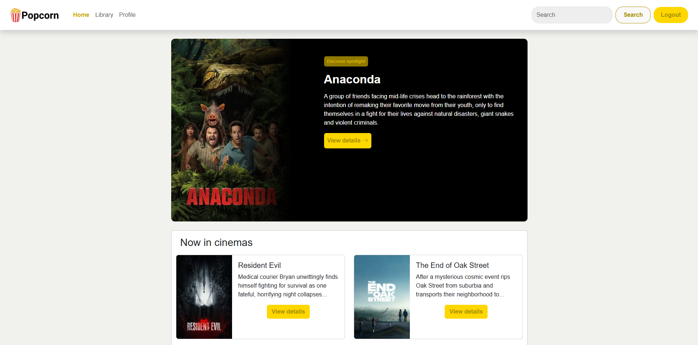
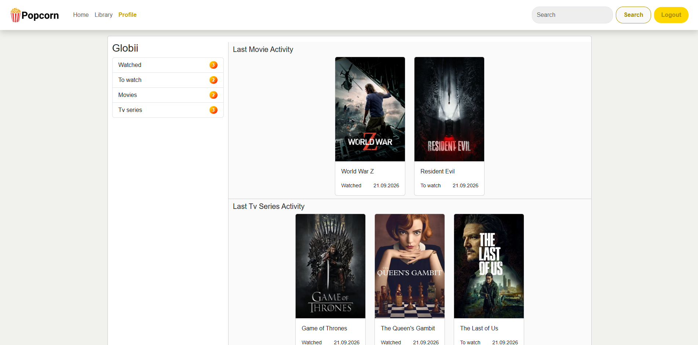
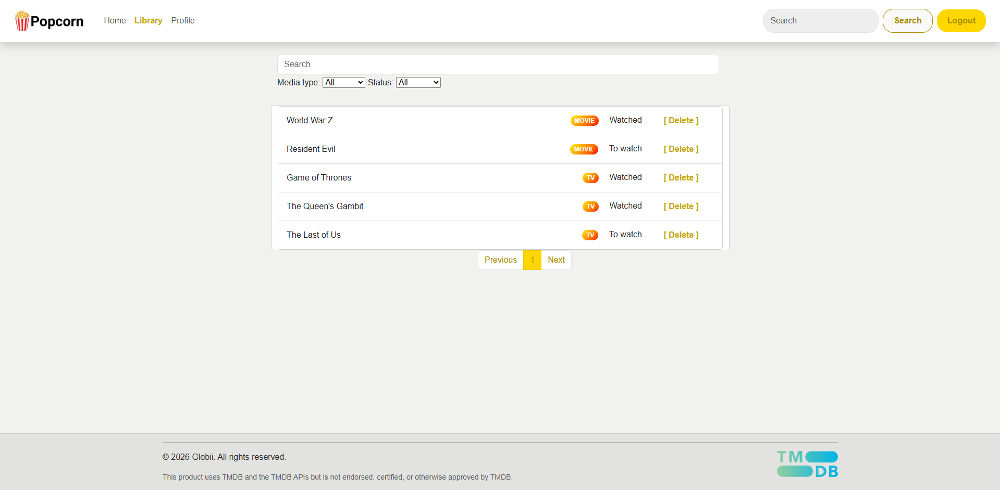
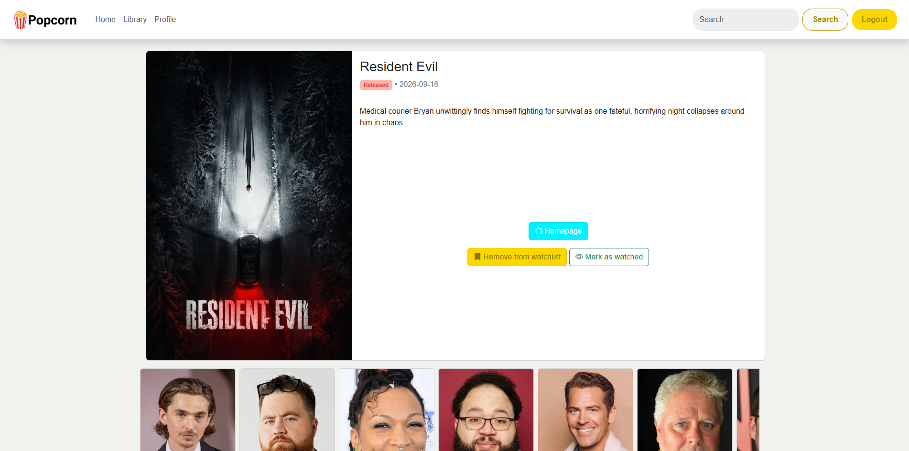

# Popcorn API & Web App

Popcorn is a personal web application for tracking movies and TV series, created to help manage your own media library and monitor watchlists.

This project was built to learn fullstack architecture, focusing on a C# .NET backend and a clean Blazor WebAssembly frontend interface.

---

## Screenshots

| Main Page | Profile |
| :---: | :---: |
|  |  |
| **Media List** | **Movie Details** |
|  |  |

---

## Tech Stack

### Backend
* **C# / .NET Core** – Main application logic and RESTful API architecture.
* **Entity Framework Core** – ORM (Object-Relational Mapping) for database interactions.
* **SQL Database** – Relational data storage.
* **JWT & Refresh Tokens** – Secure authentication and user session management.

### Frontend
* **Blazor / Razor Components** – Component-based user interface.
* **Bootstrap** – Responsive styling and modern UI components.

### External Services
* **TMDB (The Movie Database) API** – External provider for movie/series metadata, posters, and descriptions.

---

## Features

* **User Authentication:** Secure registration, login, and token-based session handling.
* **Library Management:** Tracking items with custom statuses (*Watched*, *To watch*).
* **Dynamic Filtering:** Filtering media by types (movies/series) or statuses using query parameters.
* **TMDB Integration:** Automatically fetching official posters and production details.
* **Dashboard:** Clean view presenting recent activity and statistical summaries.

---

## Architecture & Highlights

* **Separation of Concerns:** The app is split into a RESTful API and a frontend, ensuring a clean architecture and modularity.
* **DTO Data Transfer:** Utilizing Data Transfer Objects for secure and controlled data transfer between layers, protecting database models.
* **Routing & Parameters:** Filtering logic driven by HTTP query parameters.

---

## License & Acknowledgements

This project is for educational purposes. Movie and series metadata and posters are provided by [TMDB](https://www.themoviedb.org/).